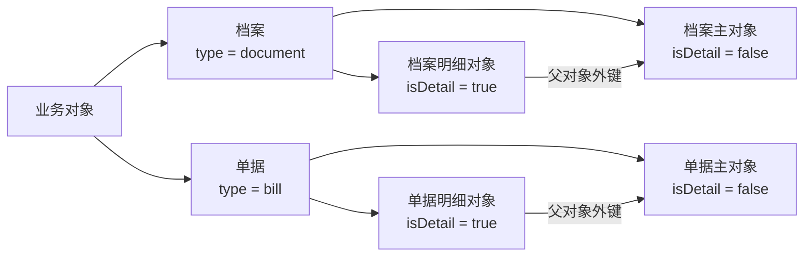
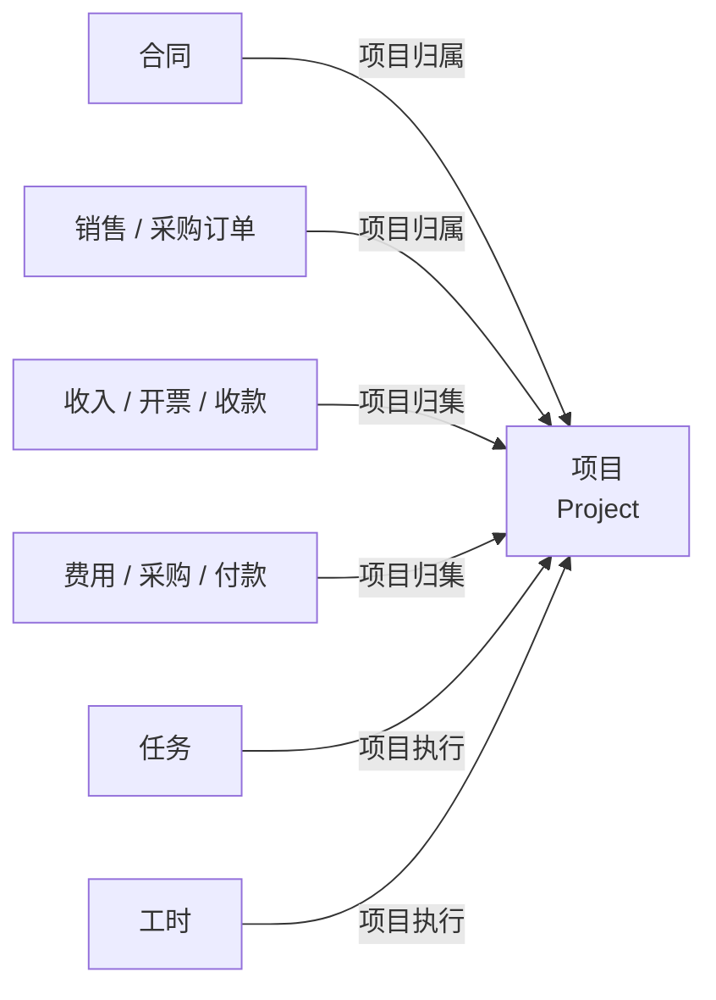

# 业务对象与业务流

## 导航

- [业务对象与字段](#业务对象与字段)
- [档案、单据与明细对象](#档案单据与明细对象)
- [项目型业财关系](#项目型业财关系)
- [单据状态](#单据状态)
- [单据类型、业务类型与枚举值](#单据类型业务类型与枚举值)

## 业务对象与字段

业务对象描述一类可被识别和处理的业务信息，例如人员、项目、合同或费用报销单据。对象由字段构成；字段定义名称、业务含义、数据类型、是否必填、允许值和引用关系。

判断业务对象时：

1. 使用对象的公开名称定位对象类型。
2. 使用字段的真实名称表达事实，不把显示名当作稳定字段标识。
3. 通过元数据确认当前租户是否提供该对象和字段。
4. 不根据中文显示名猜测技术名称，也不把个别对象中的字段当作所有对象的公共字段。

## 档案、单据与明细对象

对象元数据中的 `type` 用于区分对象类别，`isDetail` 用于区分主对象与明细对象。

| 元数据 | 取值 | 含义 | 典型使用方式 |
| --- | --- | --- | --- |
| `type` | `document` | 档案对象，描述可持续维护并被业务过程引用的基础资料 | 查询人员、部门、客户、供应商等当前资料 |
| `type` | `bill` | 单据对象，记录业务事实或业务处理过程 | 查询合同、订单、费用、收入、收付款等业务过程 |
| `isDetail` | `false` | 主对象，承载记录身份、状态和公共信息 | 先定位主记录，再处理关联明细 |
| `isDetail` | `true` | 明细对象，又称子表或明细表 | 作为行对象集合依附于主记录 |

档案强调“业务主体当前是什么”，单据强调“某次业务发生了什么、进行到哪一步”。同一业务主题可能同时存在档案、单据和明细对象，不得仅凭标题判断对象类别。

理解主子表时：

- 先定位主记录，再读取或处理其明细表。
- 把明细表表示为行对象数组，不把多行内容拼成一个字符串。
- 不假设明细行拥有独立于主记录的完整生命周期。
- 只有当前公开能力和元数据明确支持时，明细事实才可写入。
- 系统生成的主键、状态和审计信息不属于用户业务输入。

## 项目型业财关系

企企服务业ERP以项目为常见的业务与财务归集维度。多数项目型经营单据会在主对象、明细对象或两者上提供指向 `Project` 的项目外键，常见字段为 `projectId` 或 `project`。字段是否存在以及应写入哪一层，必须以当前对象元数据为准。

查询项目经营情况时，以项目为关联入口分别取得业务事实，再按业务日期、状态和对象语义汇总。不得仅按金额字段相加，也不得把计划、申请、确认、开票、收付款视为同一事实。

## 单据状态

单据状态描述记录当前所处的业务处理阶段。常见主线如下，但具体对象、租户和单据类型不一定启用全部阶段：

使用状态时：

1. 查询当前状态后再决定可执行动作。
2. 使用当前记录公开的业务动作推进流程，不直接改写状态字段。
3. 把“已提交”与“已生效”视为不同事实。
4. 修改、撤回、退回、关闭、结案或作废能力以当前记录允许的动作和运行时规则为准。
5. 状态值和显示标题以当前运行时返回为准（通常是`BillStatus.draft`/`BillStatus.effective`之类的格式），不从本文件构造枚举值。

## 单据类型、业务类型与枚举值

| 概念 | 作用 | 使用原则 |
| --- | --- | --- |
| 单据类型 | 区分同一业务对象的表单形态或处理流程 | 使用当前对象实际提供的类型，不根据名称构造编码 |
| 业务类型 | 描述记录所承载的业务场景或用途 | 先发现当前租户允许的业务类型 |
| 枚举值 | 限定字段可选择的有限值 | 使用运行时返回的真实值，不用显示文本代替 |

三者可能共同影响字段、默认值和流程，但含义不同。Agent 应表达用户意图，由系统依据当前配置确定适用规则；除非工具明确要求，不提交配置标识。
