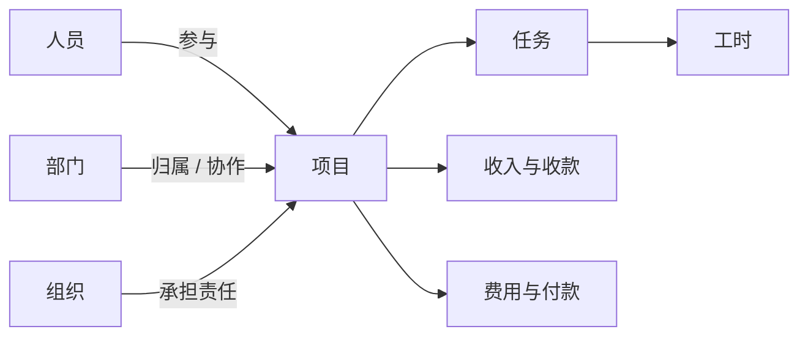
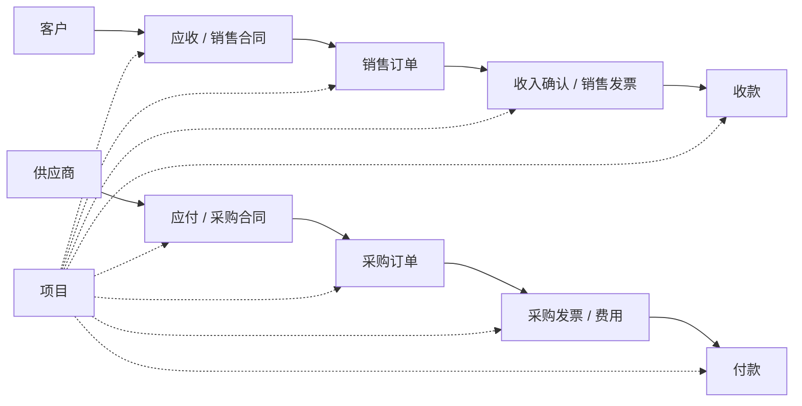

# 核心业务概念

## 导航

- [组织与业务主体](#组织与业务主体)
- [项目](#项目)
- [费用、收入与口径](#费用收入与口径)
- [从用户表达判断业务阶段](#从用户表达判断业务阶段)
- [项目型业财主线](#项目型业财主线)

## 组织与业务主体

| 概念  | 业务含义                   | 识别注意                  |
| --- | ---------------------- | --------------------- |
| 人员  | 参与业务工作的自然人及其业务身份       | 不自动等同于登录用户；姓名不唯一时必须消歧 |
| 部门  | 人员和职责的管理单元，通常具有上下级关系   | 不自动等同于承担核算或经营责任的组织    |
| 组织  | 业务开展、管理或责任归属的主体        | 同一企业可能存在不同用途的组织结构     |
| 客户  | 销售、应收、收入和收款业务中的交易相对方   | 名称相近时使用编码或其他稳定信息消歧    |
| 供应商 | 采购、应付、成本和付款业务中的交易相对方   | 不根据客户记录推导供应商身份        |
| 联系人 | 依附客户、供应商等主对象的联系人明细     | 先确定所属主对象，再定位联系人       |
| 存货  | 可被采购、销售或履约业务引用的商品或物料资料 | 使用对象字段确认规格、单位和可用范围    |

## 项目

项目是围绕明确目标、周期、团队和业务结果组织工作的主体，可关联合同、订单、任务、工时、费用、收入和收付款。查询或写入项目相关数据时，优先使用项目 ID 或唯一编码；项目名称存在多个匹配时先消歧。

## 费用、收入与口径

费用表示业务活动消耗的资源及其归属，可能经由申请、借款、报销、采购或付款等阶段形成。申请金额、批复金额、已发生成本和已付款金额是不同事实，不得相互替代。

收入表示业务活动形成的经济流入或确认结果，可能关联客户、合同、项目、组织和业务日期。计划、合同、履约、收入确认、开票和收款分别代表不同阶段。

利润、预算执行率、完成率等指标是对业务事实的推导。只有当前产品能力提供权威口径，或用户明确确认口径且底层数据完整时才计算；否则分别展示原始事实、推导条件和未知项。

## 从用户表达判断业务阶段

先确定业务阶段，再选择对象。用户表达存在以下歧义时，提出一个最能缩小范围的问题：

| 用户表达    | 候选业务阶段               | 优先消歧问题                    |
| ------- | -------------------- | ------------------------- |
| “查一下合同” | 应收合同、应付合同、销售合同、采购合同  | 关注客户侧还是供应商侧？要看合同约定还是后续执行？ |
| “看项目收入” | 合同额、收入确认、销售开票、实际收款   | 需要哪个业务阶段、截止日期和统计口径？       |
| “看项目利润” | 合同、确认收入、成本、收付款等多阶段事实 | 使用哪套权威利润口径、期间、税额和币种？      |
| “看预算执行” | 预算、占用、申请、承诺、发生、付款    | “执行”具体指哪个阶段和预算版本？         |
| “帮我建任务” | 项目任务、日常任务、子任务        | 是否归属项目？如果是子任务，父任务是哪一个？    |
| “查费用”   | 事前申请、报销、采购成本、应付、实际付款 | 关注申请、费用发生、应付还是已经支付？       |
| “看工时”   | 项目级工时、任务级工时          | 按项目还是具体任务查看？关注哪些人员和日期？    |
| “查收付款”  | 收付款申请、实际收付款、核销或结算    | 关注申请过程还是已经发生的资金事实？        |

用户已给出明确阶段时不要重复提问。仍有多个候选且会改变查询对象或写入结果时，必须先消歧。

## 项目型业财主线

下图用于理解常见业务阶段，不表示每个租户都启用了全部对象，也不表示阶段之间只能按图中顺序流转。

虚线表示这些业务记录常通过 `projectId` 或 `project` 外键归集到项目。实际字段位于主对象还是明细对象，必须通过元数据确认。