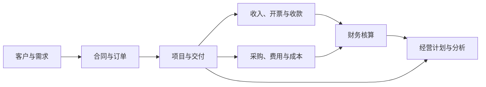

# 产品定位与能力地图

## 产品定位

企企服务业ERP面向以人员、项目和专业服务为重要经营资源的企业，强调业务、财务与决策一体化。理解产品时，不应把它看成彼此隔离的模块集合，而应关注从客户需求、合同与项目执行，到收入成本、收付款、财务核算和经营分析的事实链。

项目是常见的经营和核算维度，但不是所有业务记录都必然归属于项目。具体对象是否关联项目、关联位于主表还是明细表，必须由当前企业的元数据确认。

## 产品平台与业务能力域

[企企官网](https://www.77hub.com/)当前以项目管理、经营计划、客户管理、智元和运营管理等平台呈现产品能力。这些名称用于产品导航，不是稳定的数据模型边界，也不证明当前企业启用了对应能力。

Agent 应优先使用以下稳定业务能力域理解用户意图：

| 能力域 | 主要业务问题 | 典型事实 |
| --- | --- | --- |
| 组织与资源 | 谁参与业务、承担责任或提供服务 | 人员、部门、组织、项目成员、工时和资源安排 |
| 客户与合同 | 为谁提供服务、约定了什么 | 客户、联系人、商机、销售或应收合同、合同金额与履约约定 |
| 项目与交付 | 工作如何计划、执行和验收 | 项目、预算、阶段、任务、工时、成果和进度 |
| 采购与供应 | 从谁采购、采购什么、是否到货 | 供应商、请购、采购合同、采购订单、到货和存货 |
| 费用与成本 | 资源消耗发生在哪个阶段并归属于谁 | 申请、借款、报销、采购成本、人工成本和成本分摊 |
| 收入与资金 | 收入是否确认、是否开票和收付 | 收入确认、应收应付、发票、收款、付款和资金流水 |
| 财务核算 | 业务事实如何进入会计与管理核算 | 事项、凭证、总账、资产、账簿和财务报表 |
| 经营计划与分析 | 目标是否达成、偏差和风险在哪里 | 经营目标、预算、执行数、利润、现金和分析指标 |
| 平台扩展与智能 | 如何适配企业差异并形成自动化能力 | 自定义档案、单据、流程、报表、集成和智能体 |

能力域可以交叉。例如合同既属于客户经营，也可能形成项目收入依据；工时既是项目执行事实，也可能成为人工成本分摊依据。不要因为一个对象出现在某个能力域，就排除它与其它能力域的关系。

## 核心业务主线

这条主线只表示常见事实关系，不表示所有企业采用相同流程，也不表示记录只能按图中顺序产生。

判断跨域问题时：

1. 先确定用户关注的业务主体、能力域和业务阶段。
2. 再定位承载事实的对象、记录及稳定关联。
3. 分开计划、申请、约定、执行、确认、开票、收付款和核算事实。
4. 最后在范围、期间、币种和数据完整性明确时进行汇总或推导。

## 能力边界

- 产品能力地图用于解释和路由，不作为当前企业对象清单。
- 官网描述可以证明产品范围，不能证明租户配置、用户权限或 qiqi 操作入口。
- 当前对象、字段、枚举、视图和动作以运行时发现结果为准。
- 平台名称、菜单结构和营销分类可能随产品演进，不应据此构造技术名称。
- 对象未发现时，只能报告当前范围未确认；不得推断产品或企业一定不支持该业务。
