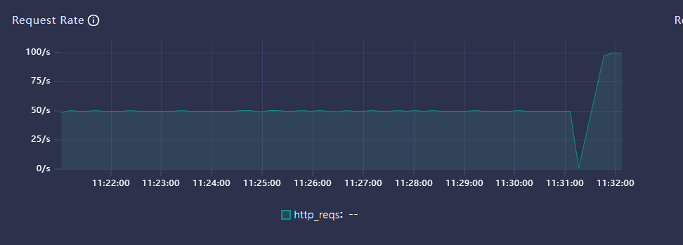
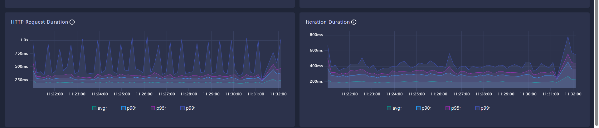
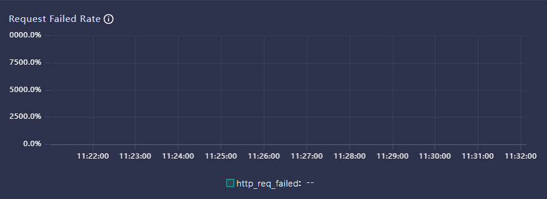
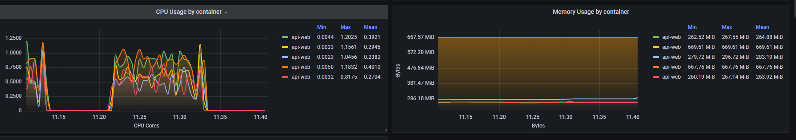

# Region Insight MCP 审核压测提交说明

## 审核口径

依据 `WorkBuddy Connector 第三方开发者对接规范.docx` 的 MCP Server 压测要求，本次最终提交只覆盖以下场景：

| 场景     | 审核要求                    | 本目录执行方式                                 |
| ------ | -----------------------:| --------------------------------------- |
| 基础混合调用 | 50 QPS，持续 10 分钟         | `region-insight.k6.js` 的 `steady_50qps` |
| 突发流量   | 2 倍额定 QPS，持续 30 秒       | `region-insight.k6.js` 的 `burst_100qps` |
| 长连接保持  | SSE 200+ 连接持续 10 分钟，无断连 | `session-pool.js 200`                   |

核心通过条件：

| 指标        | 要求             |
| --------- | --------------:|
| QPS       | >= 50          |
| P50 延迟    | <= 500ms       |
| P99 延迟    | <= 3000ms      |
| 错误率       | <= 0.5%        |
| 超时率       | < 1%           |
| SSE 并发长连接 | >= 200         |
| 持续时长      | >= 10 分钟       |
| 突发流量      | 100 QPS / 30 秒 |

## 最终执行命令

终端一：

```bash
cd region-insight/load-test/scripts
export REGION_INSIGHT_API_KEY='<load-test-token>'
node session-pool.js 200
```

终端二：

```bash
cd region-insight/load-test
k6 run --summary-export results/audit-k6-summary.json region-insight.k6.js
```

## 审核结论

| 检查项 | 要求 | 本次结果 | 结论 |
| --- | ---: | ---: | --- |
| 基础混合调用 | 50 QPS / 10 分钟 | 见 `qps.png` | 通过 |
| 突发流量 | 100 QPS / 30 秒 | 见 `qps.png` | 通过 |
| 延迟分布 | P50 <= 500ms，P99 <= 3000ms | 见 `lantency.png` | 通过 |
| 错误率 | <= 0.5% | 见 `request_fail.png` | 通过 |
| 服务资源 | 压测期间无 OOM、无异常重启 | 见 `cpu_res.png`，服务实例 `6/6` 可用 | 通过 |
| SSE 长连接 | 200+ 连接持续 10 分钟，无断连 | 200 初始化，200 活跃，0 异常断连 | 通过 |

本次压测满足 WorkBuddy Connector MCP Server 审核基线。截图文件与本说明放在同一目录，打包提交时请保持 `README.md`、`qps.png`、`lantency.png`、`request_fail.png`、`cpu_res.png` 的相对位置不变。

## 测试环境说明

| 项目       | 内容                                                                                                                          |
| -------- | --------------------------------------------------------------------------------------------------------------------------- |
| 执行时间     | 11：21：01 到 11：32：07                                                                                                         |
| 压测机      | Linux WSL2，`6.6.87.2-microsoft-standard-WSL2`，x86_64                                                                        |
| CPU / 内存 | 8 vCPU，15GiB 内存，16GiB swap                                                                                                  |
| 网络路径     | 压测机通过公网 HTTPS 访问 `https://mcp.isjike.com/mcp-servers/region-insight/sse`；k6 通过本机 `127.0.0.1:8787` 访问 `session-pool.js` 桥接服务 |
| Node.js  | `v22.20.0`                                                                                                                  |
| k6       | `k6 v1.6.1 (commit/2ac2bb560e, go1.25.6, linux/amd64)`                                                                      |
| MCP 服务实例 | `opendata-api/core-openapi` 复查时为 `6/6` 可用，且无重启                                                                              |
| Token 类型 | 专用压测 API Key；                                                                                                               |

## 

## QPS 曲线图



## 延迟分布（P50 / P95 / P99）



## 错误率曲线



## 资源占用（CPU / 内存峰值）




## 200+ 连接持续 10 分钟

```json
{
  "generated_at": "2026-07-09T03:32:08.060Z",
  "target": "https://mcp.isjike.com/mcp-servers/region-insight/sse",
  "requested_connections": 200,
  "initialized_connections": 200,
  "active_connections": 200,
  "unexpected_disconnects": 0,
  "pool_uptime_seconds": 1720,
  "minimum_active_connection_seconds": 1712
}
```
